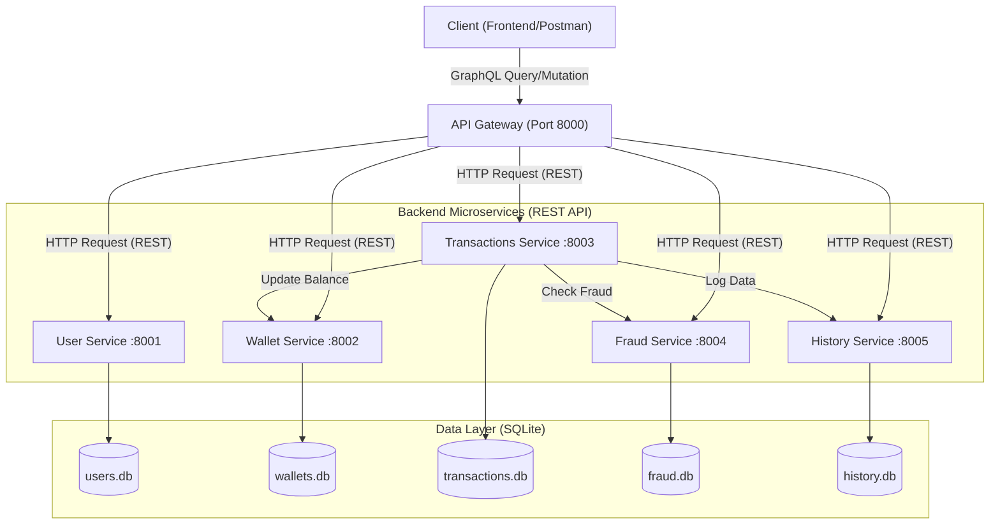

# Dompet Digital Sawit Microservices

## Deskripsi Proyek

Dompet Digital Sawit adalah sistem layanan keuangan digital yang dibangun menggunakan arsitektur microservices. Proyek ini menerapkan konsep "Modernisasi REST API dengan GraphQL Wrapper".

Meskipun setiap layanan (service) di belakang layar berkomunikasi menggunakan protokol REST API standar, klien (Frontend/User) hanya berinteraksi melalui satu pintu masuk (API Gateway) yang menggunakan GraphQL.

Konsep Hybrid (GraphQL Wrapper):
Sistem ini menggunakan API Gateway yang bertindak sebagai "Wrapper" atau pembungkus. Ketika klien mengirim Query atau Mutation GraphQL, Gateway akan:
1. Menerima request GraphQL.
2. Menerjemahkannya menjadi request HTTP (REST).
3. Mengirim request ke microservice terkait (User, Wallet, dll).
4. Mengembalikan respons gabungan ke klien dalam format JSON GraphQL.

Arsitektur sistem ini terdiri dari beberapa komponen utama:
* API Gateway (GraphQL): Pintu masuk tunggal yang menggabungkan semua skema.
* User Service: Menangani autentikasi (JWT + RSA) dan data pengguna.
* Wallet Service: Mengelola saldo dompet, top-up, dan pemotongan saldo.
* Transactions Service: Menangani logika transfer, pembayaran, dan deposit.
* Fraud Service: Mendeteksi transaksi mencurigakan atau penipuan.
* History Service: Mencatat riwayat transaksi secara asynchronous.

---

## Arsitektur Sistem



---

## Cara Menjalankan Proyek

1. Persiapan Environment
Salin file .env.example menjadi .env di setiap folder service.
* user-service/.env
* wallet-service/.env
* transactions-service/.env
* fraud-service/.env
* history-service/.env

2. open gitbash, run ('cd user-service')
   
4. Jalankan
```bash
 openssl genrsa -out private.pem 2048
```

```bash
 openssl rsa -in private.pem -pubout -out public.pem
``` 

4. Copy file public.pem from user-service

6. Paste file public.pem from user-service to each services

8. Navigate to the project root

```bash
 cd d:\Project\Project-UAS-IAE_Dompet-Digital-Sawit
```

10. Jalankan Docker Compose
Bangun dan jalankan semua container sekaligus:
```bash
docker-compose up --build -d

```


4. Akses GraphQL Playground
Setelah semua service berjalan, buka browser dan akses URL berikut untuk menguji API:
http://localhost:8000/graphql

---

## Ringkasan Endpoint & Port

Berikut adalah daftar port untuk setiap layanan:

| Service | Port (Host) | Tipe API Internal | Database |
| --- | --- | --- | --- |
| API Gateway | 8000 | GraphQL | - |
| User Service | 8001 | REST | users.db |
| Wallet Service | 8002 | REST | wallets.db |
| Transactions Service | 8003 | REST | transactions.db |
| Fraud Service | 8004 | REST | fraud.db |
| History Service | 8005 | REST | history.db |

---

## Panduan Penggunaan API (GraphQL)

Semua request dikirim ke http://localhost:8000/graphql.

### 1. Autentikasi (User Service)

Register User:

```graphql
mutation {
  registerUser(
    username: "akmal", 
    fullname: "Akmal Amran", 
    email: "akmal@test.com", 
    password: "123"
  )
}

```

Login User:

```graphql
mutation {
  loginUser(email: "akmal@test.com", password: "123") {
    access_token
    user {
      username
      role
    }
  }
}

```

Catatan: Simpan access_token untuk digunakan pada header Authorization.

### 2. Manajemen Dompet (Wallet Service)

Gunakan Header: Authorization: Bearer <TOKEN_ANDA>

Buat Wallet Baru:

```graphql
mutation {
  createWallet(walletName: "Tabungan Utama") {
    walletId
    balance
    status
  }
}

```

Cek Saldo:

```graphql
query {
  myWallets {
    walletName
    balance
  }
}

```

### 3. Transaksi (Transaction Service)

Gunakan Header: Authorization: Bearer <TOKEN_ANDA>

Top Up (Deposit):

```graphql
mutation {
  createTransaction(input: {
    walletId: "ID_WALLET_ANDA",
    amount: 500000,
    type: DEPOSIT
  }) {
    transactionId
    status
    amount
  }
}

```

Pembayaran (Payment):

```graphql
mutation {
  createTransaction(input: {
    walletId: "ID_WALLET_ANDA",
    amount: 20000,
    type: PAYMENT,
    vaNumber: "12345678"
  }) {
    transactionId
    status
  }
}

```

### 4. Deteksi Fraud & Admin (Fraud Service)

Admin dapat melihat log transaksi yang mencurigakan.

* Transaksi > 10.000.000 = SUSPICIOUS
* Transaksi > 50.000.000 = FRAUD (Gagal)

Cek Log (Khusus Admin):

```graphql
query {
  getFraudLogs {
    logId
    userId
    amount
    status
    reason
  }
}

```

---

## Teknologi yang Digunakan

* Language: Python 3.10
* Framework: FastAPI
* GraphQL Tools: Ariadne (Schema-first approach)
* HTTP Client: HTTPX (Untuk komunikasi antar service)
* Database: SQLite & SQLAlchemy ORM
* Auth: Python-Jose (JWT dengan RSA256)
* Containerization: Docker & Docker Compose

```

```
