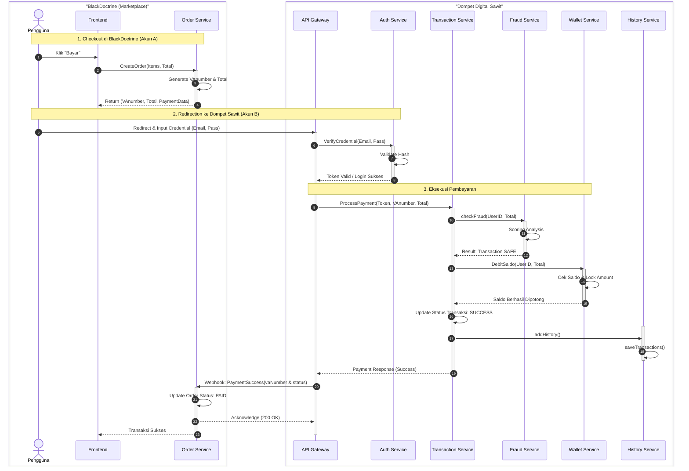

# Dompet Digital Sawit - Microservices

---

## Deskripsi Proyek

**Dompet Digital Sawit** adalah sistem layanan keuangan digital yang dibangun menggunakan arsitektur **Microservices** terdistribusi dengan penerapan **Independent JWT Authentication**.

Proyek ini dirancang untuk menjawab tantangan arsitektur monolitik tradisional dengan memecah sistem menjadi layanan-layanan yang otonom, terisolasi, dan saling berkomunikasi menggunakan protokol **GraphQL** di atas HTTP. Setiap layanan berjalan dalam kontainer terpisah (Docker) dan memiliki basis data masing-masing (*Database-per-Service*) untuk menjamin independensi data dan mencegah kegagalan sistem secara menyeluruh (*Single Point of Failure*).

Sistem ini bertindak sebagai *Service Provider* yang menangani pemrosesan transaksi pembayaran, manajemen saldo, validasi keamanan (Fraud Detection), serta pencatatan audit, dan terintegrasi dengan sistem eksternal (Marketplace) secara *real-time*.

### Fitur & Karakteristik Utama

1. **Arsitektur Microservices Terdistribusi:**
Sistem terdiri dari lima layanan utama yang memiliki tanggung jawab spesifik:
    * **Auth Service:** Mengelola identitas pengguna dan keamanan berbasis *Independent JWT Authentication* menggunakan algoritma asimetris RS256.


    * **Transaction Service:** Bertindak sebagai *Payment Gateway* dan orkestrator yang mengatur alur pembayaran dari inisiasi hingga penyelesaian.


    * **Wallet Service:** Mengelola penyimpanan dana (*Fund Manager*) dan memastikan integritas saldo pengguna secara atomik.


    * **Fraud Detection Service:** Mesin keamanan yang memvalidasi risiko transaksi dan mencegah aktivitas mencurigakan atau penipuan.


    * **History Service:** Layanan pencatatan audit (*Audit Trail*) yang menyimpan riwayat mutasi transaksi untuk kebutuhan pelaporan.


2. **Full Native GraphQL Communication:**
Seluruh komunikasi antar-layanan (Inter-service) maupun dengan klien eksternal dilakukan menggunakan *Query* dan *Mutation* GraphQL, memberikan kontrak data yang eksplisit dan fleksibel.


3. **API Gateway Proxy:**
Menggunakan Gateway sebagai pintu masuk tunggal (*Entry Point*) yang meneruskan permintaan klien ke layanan mikro yang relevan.


4. **Integrasi Eksternal (Marketplace):**
Sistem menyediakan endpoint publik untuk memproses pembayaran dari aplikasi Marketplace luar (seperti *BlackDoctrine*), memvalidasi tagihan via Virtual Account, dan memberikan respon status pelunasan secara otomatis.

---

## Arsitektur Sistem


## Cara Menjalankan Proyek

Ikuti langkah-langkah berikut untuk menjalankan sistem secara lokal menggunakan Docker.

### 1. Persiapan Environment

```bash
python gsetup_env.py

```

### 2. Generate RSA Keys (Otomatis)

Sistem menggunakan enkripsi RSA (RS256) untuk keamanan token JWT. Kami telah menyediakan skrip python untuk membuatnya secara otomatis.

```bash
pip install cryptography

```

Buka terminal di *root folder* proyek dan jalankan:

```bash
python generate_keys.py

```

*Skrip ini akan:*

* Membersihkan kunci lama yang mungkin rusak.
* Membuat `private.pem` dan `public.pem` baru.
* Menyimpannya di folder `user-service`.
* *(Catatan: Docker Compose akan otomatis membagikan `public.pem` ke service lain).*

### 3. Jalankan dengan Docker Compose

Bangun dan jalankan semua container sekaligus:

```bash
docker-compose up --build -d

```

### 4. Akses GraphQL Playground

Setelah semua service berjalan (tunggu sekitar 10-20 detik), buka browser Anda:

* **URL:** `http://localhost:8000/graphql`
* Gunakan Playground ini untuk menguji semua Query dan Mutation.

---

## Daftar Layanan & Port

Semua layanan mengekspos endpoint GraphQL di path `/graphql`.

| Service | Port (Host) | Tipe API | Database |
| --- | --- | --- | --- |
| **API Gateway** | **8000** | **GraphQL Proxy** | - |
| Auth Service | 8001 | Native GraphQL | `users.db` |
| Wallet Service | 8002 | Native GraphQL | `wallets.db` |
| Transactions Service | 8003 | Native GraphQL | `transactions.db` |
| Fraud Service | 8004 | Native GraphQL | `fraud.db` |
| History Service | 8005 | Native GraphQL | `history.db` |

---

## Daftar Operasi GraphQL

Berikut adalah daftar lengkap Query dan Mutation yang tersedia di sistem. Semua request dikirim ke `http://localhost:8000/graphql`.

| Service | Tipe | Nama Operation | Deskripsi & Parameter Input |
| :--- | :--- | :--- | :--- |
| **Auth Service** | Mutation | `registerUser` | Mendaftarkan pengguna baru.<br>*(Input: username, fullname, email, password)* |
| | Mutation | `loginUser` | Login untuk mendapatkan token akses (JWT).<br>*(Input: email, password)* |
| | Query | `myProfile` | Mengambil profil pengguna saat ini.<br>*(Input: token)* |
| **Wallet Service** | Mutation | `createWallet` | Membuat dompet digital baru.<br>*(Input: walletName)* |
| | Mutation | `topupWallet` | Menambah saldo dompet (Deposit).<br>*(Input: walletId, amount)* |
| | Mutation | `deductWallet` | Mengurangi saldo (Pembayaran/Transfer).<br>*(Input: walletId, amount)* |
| | Query | `myWallets` | Melihat daftar dompet dan saldo milik pengguna. |
| **Transaction Service** | Mutation | `createTransaction` | Memproses transaksi baru.<br>*(Input: walletId, amount, type [DEPOSIT/PAYMENT/TRANSFER], vaNumber [opsional])* |
| | Query | `myTransactions` | Melihat riwayat transaksi pengguna. |
| **Fraud Service** | Mutation | `checkFraud` | Mengecek risiko transaksi (Internal).<br>*(Input: userId, amount)* |
| | Mutation | `deleteFraudLog` | Menghapus log deteksi fraud (Admin Only).<br>*(Input: logId)* |
| | Query | `getFraudLogs` | Melihat seluruh log deteksi fraud (Admin Only). |
| **History Service** | Mutation | `addHistory` | Mencatat log riwayat mutasi baru.<br>*(Input: HistoryInput)* |
| | Mutation | `deleteHistory` | Menghapus catatan riwayat tertentu.<br>*(Input: historyId)* |
| | Query | `myHistory` | Mengambil daftar lengkap riwayat mutasi pengguna. |

---

## Panduan Penggunaan API

Semua request dikirim ke `http://localhost:8000/graphql`.

### 1. Autentikasi (Auth)

**Register:**

```graphql
mutation {
  registerUser(
    username: "narto", 
    fullname: "Naruto Uzumaki", 
    email: "naruto@gmail.com", 
    password: "password123"
  )
}

```

**Login:**

```graphql
mutation {
  loginUser(email: "naruto@gmail.com", password: "password123") {
    access_token
    user {
      username
      role
    }
  }
}

```

*Copy `access_token` dari respon Login untuk digunakan pada Header Authorization.*

### 2. Manajemen Dompet (Wallet)

*Gunakan Header:* `Authorization: Bearer <TOKEN_ANDA>`

**Buat Wallet Baru:**

```graphql
mutation {
  createWallet(walletName: "Tabungan Utama") {
    walletId
    walletName
    balance
    status
  }
}

```

*Copy `walletId` untuk digunakan saat transaksi.*

**Cek Saldo:**

```graphql
query {
  myWallets {
    walletName
    balance
    status
  }
}

```

### 3. Transaksi (Transaction)

*Gunakan Header:* `Authorization: Bearer <TOKEN_ANDA>`

**Top Up (Deposit):**

```graphql
mutation {
  createTransaction(input: {
    walletId: "PASTE_WALLET_ID_DISINI",
    amount: 500000,
    type: DEPOSIT
  }) {
    transactionId
    status
    amount
    createdAt
  }
}

```

**Pembayaran Integrasi (Payment):**
Sistem akan menghubungi Marketplace eksternal untuk validasi VA Number.

```graphql
mutation {
  createTransaction(input: {
    walletId: "PASTE_WALLET_ID_DISINI",
    amount: 20000,
    type: PAYMENT,
    vaNumber: "VA_MARKETPLACE"
  }) {
    transactionId
    status
    vaNumber
  }
}

```

### 4. Riwayat (History)

*Gunakan Header:* `Authorization: Bearer <TOKEN_ANDA>`

**Cek riwayat transaksi:**

```graphql
query cekHistori{
  myHistory {
    historyId
    transactionId
    amount
    type
    status
    createdAt
  }
}
```

### 5. Admin & Fraud

*Login dengan akun admin (lihat `.env` user-service) untuk akses ini.*

**Cek Log Fraud:**

```graphql
query {
  getFraudLogs {
    logId
    userId
    amount
    status
    reason
  }
}

```

---
## Diagram Sequence Integrasi

---
## Tes Integrasi 
- BlackDoctrine (Marketplace): http://localhost:7001/graphql & http://localhost:7003/graphql
- Dompet Digital Sawit: http://localhost:8000/graphql
### 1. Registrasi Marketplace (7001)
```graphql
mutation RegisterUser($nama: String!, $email: String!, $password: String!) {
  register(nama: $nama, email: $email, password: $password) {
    id
    nama
    email
    role
    isActive
    statusLabel
  }
}
```
Variabel:
```graphql
{
  "nama": "Sakura Haruno",
  "email": "sakura@gmail.com",
  "password": "password123"
}
```

### 2. Login Marketplace (7001)
```graphql
mutation LoginUser($email: String!, $password: String!) {
  login(email: $email, password: $password) {
    token
    user {
      id
      nama
      email
      role
      isActive
      statusLabel
    }
  }
}
```
Variabel:
```graphql
{
  "email": "sakura@gmail.com",
  "password": "password123"
}
```
*Copy `token` untuk dimasukkan di header (Authorization)*

### 3. Buat Order (7003)
```graphql
mutation BuatOrderBaru {
  createOrder(input: {
    productId: "1",       
    quantity: 2,
    alamatPengiriman: "Jalan Konoha No. 02",
    metodePengiriman: "REGULER"
  }) {
    id
    totalHarga # <--- COPY Harga INI untuk langkah selanjutnya 
    nomorVA  # <--- COPY NOMOR INI untuk langkah selanjutnya         
    status
    paymentStatus
    ongkir
  }
}
```

### 4. Melakukan Pembayaran di Dompet Digitak Sawit (8000)
```graphql
mutation {
  createTransaction(input: {
    walletId: "PASTE_WALLET_ID_DISINI",
    amount: totalHarga, # <--- Paste totalHarga disini
    type: PAYMENT,
    vaNumber: "VA_MARKETPLACE" # <--- Paste nomorVA disini
  }) {
    transactionId
    status
    vaNumber
  }
}
```

### 5. Cek Tagihan (7003)
```graphql
query CekTagihanByVA {
  getOrderByVA(vaNumber: "VA_MARKETPLACE") {
    id
    totalHarga
    status
    paymentStatus
    productId
    quantity
  }
}
```
---

## Teknologi yang Digunakan

* **Language:** Python 3.10
* **Framework:** FastAPI
* **GraphQL Engine:** Ariadne (Schema-first)
* **Communication:** HTTPX (Asynchronous GraphQL Client antar service)
* **Database:** SQLite & SQLAlchemy ORM
* **Auth:** JWT (RS256 Algorithm)
* **Infrastructure:** Docker & Docker Compose

---
## Anggota Kelompok

| Nama | NIM | Peran / Service |
| --- | --- | --- |
| **AHMAD AKMAL AMRAN** | 102022300010 | Transactions Service |
| **FIRDAUS AL HAMID** | 102022300403 | Wallet Service |
| **ILHAM FAHMI** | 102022300223 | Fraud Service |
| **DHYDO ARYO JAYANATA** | 102022300370 | History Service |

```

```
