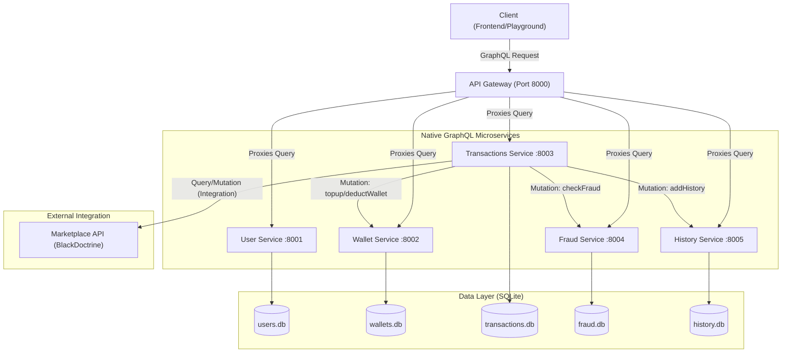

# Dompet Digital Sawit - Full Native GraphQL Microservices

## Deskripsi Proyek

**Dompet Digital Sawit** adalah sistem layanan keuangan digital berbasis arsitektur *microservices*. Berbeda dengan versi sebelumnya, versi ini menerapkan arsitektur **Full Native GraphQL**.

Setiap layanan (*microservice*) memiliki **GraphQL Server** sendiri yang langsung menangani *Query* dan *Mutation*. Komunikasi antar layanan (contoh: *Transaction Service* memanggil *Wallet Service*) juga dilakukan menggunakan protokol GraphQL.

**Fitur Utama:**
1.  **Full GraphQL:** Semua layanan mengekspos endpoint `/graphql`.
2.  **API Gateway Proxy:** Gateway bertindak sebagai *router* pintar yang meneruskan query klien ke layanan yang tepat.
3.  **Inter-Service GraphQL Communication:** Layanan saling bertukar data menggunakan *query/mutation* GraphQL.
4.  **External Integration:** Terintegrasi dengan sistem Marketplace luar (*BlackDoctrine*) untuk pembayaran via Virtual Account.

---

## Arsitektur Sistem



## Cara Menjalankan Proyek

Ikuti langkah-langkah berikut untuk menjalankan sistem secara lokal menggunakan Docker.

### 1. Persiapan Environment

Salin file `.env.example` menjadi `.env` di setiap folder service:

* `user-service/.env`
* `wallet-service/.env`
* `transactions-service/.env`
* `fraud-service/.env`
* `history-service/.env`

### 2. Generate RSA Keys (Otomatis)

Sistem menggunakan enkripsi RSA (RS256) untuk keamanan token JWT. Kami telah menyediakan skrip python untuk membuatnya secara otomatis.

Buka terminal di *root folder* proyek dan jalankan:

```bash
python generate_keys.py

```

*Skrip ini akan:*

* Membersihkan kunci lama yang mungkin rusak.
* Membuat `private.pem` dan `public.pem` baru.
* Menyimpannya di folder `user-service`.
* *(Catatan: Docker Compose akan otomatis membagikan `public.pem` ke service lain).*

### 3. Jalankan dengan Docker Compose

Bangun dan jalankan semua container sekaligus:

```bash
docker-compose up --build -d

```

### 4. Akses GraphQL Playground

Setelah semua service berjalan (tunggu sekitar 10-20 detik), buka browser Anda:

* **URL:** `http://localhost:8000/graphql`
* Gunakan Playground ini untuk menguji semua Query dan Mutation.

---

## Daftar Layanan & Port

Semua layanan mengekspos endpoint GraphQL di path `/graphql`.

| Service | Port (Host) | Tipe API | Database |
| --- | --- | --- | --- |
| **API Gateway** | **8000** | **GraphQL Proxy** | - |
| User Service | 8001 | Native GraphQL | `users.db` |
| Wallet Service | 8002 | Native GraphQL | `wallets.db` |
| Transactions Service | 8003 | Native GraphQL | `transactions.db` |
| Fraud Service | 8004 | Native GraphQL | `fraud.db` |
| History Service | 8005 | Native GraphQL | `history.db` |

---

## Panduan Penggunaan API

Semua request dikirim ke `http://localhost:8000/graphql`.

### 1. Autentikasi (User)

**Register:**

```graphql
mutation {
  registerUser(
    username: "narto", 
    fullname: "Naruto Uzumaki", 
    email: "naruto@gmail.com", 
    password: "password123"
  )
}

```

**Login:**

```graphql
mutation {
  loginUser(email: "naruto@gmail.com", password: "password123") {
    access_token
    user {
      username
      role
    }
  }
}

```

*Copy `access_token` dari respon Login untuk digunakan pada Header Authorization.*

### 2. Manajemen Dompet (Wallet)

*Gunakan Header:* `Authorization: Bearer <TOKEN_ANDA>`

**Buat Wallet Baru:**

```graphql
mutation {
  createWallet(walletName: "Tabungan Utama") {
    walletId
    walletName
    balance
    status
  }
}

```

*Copy `walletId` untuk digunakan saat transaksi.*

**Cek Saldo:**

```graphql
query {
  myWallets {
    walletName
    balance
    status
  }
}

```

### 3. Transaksi (Transaction)

*Gunakan Header:* `Authorization: Bearer <TOKEN_ANDA>`

**Top Up (Deposit):**

```graphql
mutation {
  createTransaction(input: {
    walletId: "PASTE_WALLET_ID_DISINI",
    amount: 500000,
    type: DEPOSIT
  }) {
    transactionId
    status
    amount
    createdAt
  }
}

```

**Pembayaran Integrasi (Payment):**
Sistem akan menghubungi Marketplace eksternal untuk validasi VA Number.

```graphql
mutation {
  createTransaction(input: {
    walletId: "PASTE_WALLET_ID_DISINI",
    amount: 20000,
    type: PAYMENT,
    vaNumber: "VA_MARKETPLACE"
  }) {
    transactionId
    status
    vaNumber
  }
}

```

### 4. Admin & Fraud

*Login dengan akun admin (lihat `.env` user-service) untuk akses ini.*

**Cek Log Fraud:**

```graphql
query {
  getFraudLogs {
    logId
    userId
    amount
    status
    reason
  }
}

```

---

## Teknologi yang Digunakan

* **Language:** Python 3.10
* **Framework:** FastAPI
* **GraphQL Engine:** Ariadne (Schema-first)
* **Communication:** HTTPX (Asynchronous GraphQL Client antar service)
* **Database:** SQLite & SQLAlchemy ORM
* **Auth:** JWT (RS256 Algorithm)
* **Infrastructure:** Docker & Docker Compose

## Anggota Kelompok

| Nama | NIM | Peran / Service |
| --- | --- | --- |
| **AHMAD AKMAL AMRAN** | 102022300010 | Transactions Service |
| **FIRDAUS AL HAMID** | 102022300403 | Wallet Service |
| **ILHAM FAHMI** | 102022300223 | Fraud Service |
| **DHYDO ARYO JAYANATA** | 102022300370 | History Service |

```

```
